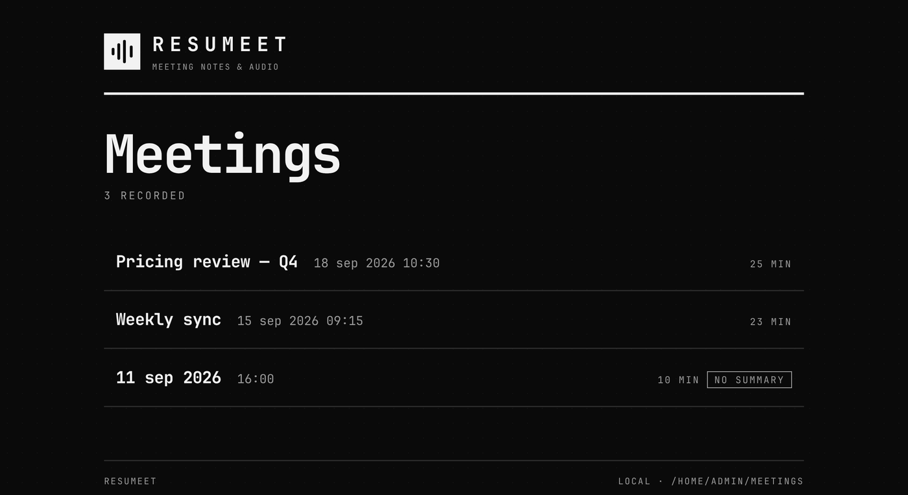
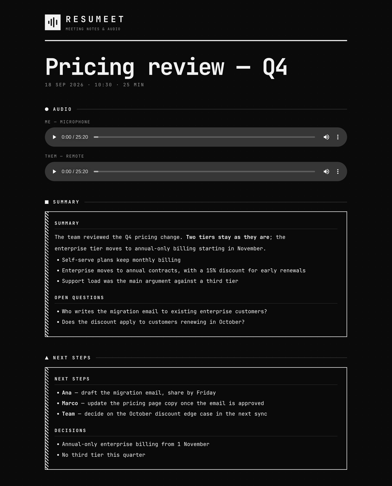
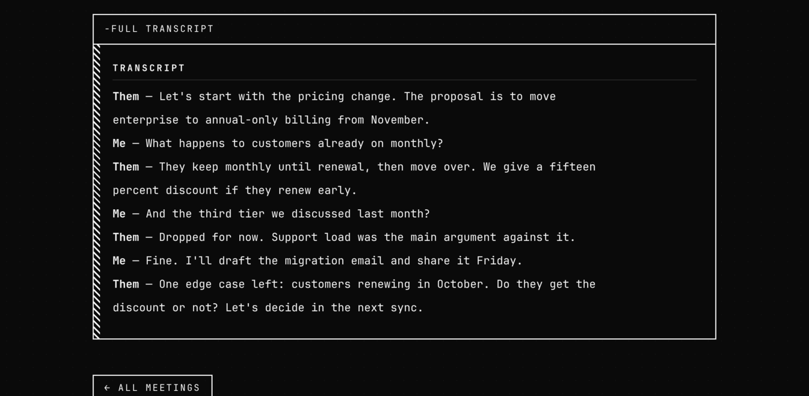

# Resumeet

*[Leer en español](README.es.md)*

Record a meeting (Meet, Zoom, anything that plays through your speakers),
transcribe it locally with whisper.cpp, and run **agents** — plain `.md` prompt
files — over the transcript: a summary, next steps, or whatever you write.

Everything runs on your machine. Only the agent step calls an LLM, and you
choose that command.


## How it works

```
shortcut / bar widget ──> meet-rec (toggle)
   │ start: ffmpeg records mic and system audio as two 16 kHz WAV tracks
   │ stop:  whisper-cli x2 (with VAD) → meet-merge → transcripcion.md
   │        for each ~/.config/resumeet/agents/<name>.md
   │          $RESUMEET_LLM "<prompt>" < transcripcion.md > <name>.md
   └─> notification "Meeting ready"          resumeet ──> local viewer
```

Two separate tracks give you speaker separation (`Me` / `Them`) without
diarization. The VAD (Silero) is mandatory: without it Whisper hallucinates
sentences over the silences, and silence is most of each track.

Output lands in `~/Reuniones/2026-09-15_1130/`: `mic.wav`, `remoto.wav`,
`transcripcion.md`, and one `.md` per agent.

## The three pieces

### 1. Bar widget (Omarchy)

A bar indicator that shows how long you have been recording and toggles
record/stop with a click. Useful when a meeting runs long and you forget you
were recording.


The widget reads the state file `meet-rec` writes, so it also reflects
recordings started from the keyboard shortcut, and it survives a shell restart
without losing count.

### 2. The recorder

One command, `meet-rec`, toggles recording. `zenity` (optional) asks for a
meeting title when you start. On stop it transcribes both tracks, merges them
into a single chronological transcript, runs every agent, and notifies you.

```
meet-rec              toggle record/stop
meet-rec --status     current state
meet-rec --self-test  records 4 s and runs the whole pipeline
```

### 3. The viewer

`resumeet` opens a local viewer (a stdlib-only HTTP server on
`127.0.0.1:8765`) listing every meeting: summary, next steps, full transcript
and one audio player per track.







The interface is available in English and Spanish — see `RESUMEET_UI_LANG`
below.

## Custom agents

An agent is a file `~/.config/resumeet/agents/<name>.md` whose contents are the
prompt. Every user on the system has their own directory, so each person builds
their own agents without touching anyone else's. The result is written to
`<name>.md` inside the meeting folder.

Example, `~/.config/resumeet/agents/mail.md`:

```
Write a short follow-up email to the participants, with the agreements and the
next steps. Only use what is in the transcript.
```

The agents shipped with the repo (`resumen`, `analisis`) are copied on install
if they don't exist; edit or delete them freely. To remove an agent, delete its
file.

## Requirements

- Linux with PipeWire/PulseAudio (`pactl`)
- `ffmpeg`, `python3`, `libnotify` (`notify-send`), optionally `zenity` (asks for a title)
- `whisper-cpp` (the `whisper-cli` binary). On Arch the `ggml` package ships no
  backend: install `ggml-cpu` or `ggml-vulkan` as well.
- An LLM CLI. `claude -p` (Claude Code) by default. Any command that takes the
  prompt as an argument and the text on stdin works, for example
  `RESUMEET_LLM="ollama run llama3"` (ollama ignores the argument and reads
  stdin; adjust to your tool).

The models (`large-v3-turbo`, 1.6 GB, and Silero VAD) download themselves on
first use, pinned and checksum-verified.

## Install

As an Omarchy plugin:

```sh
omarchy plugin add https://github.com/CristoSolar/resumeet --enable
~/.config/omarchy/plugins/io.github.cristosolar.resumeet/install.sh   # binaries and agents
```

Standalone, without Omarchy (no bar widget, everything else works):

```sh
git clone https://github.com/CristoSolar/resumeet
cd resumeet && ./install.sh
meet-rec --self-test     # records 4 s and runs the whole pipeline
```

Shortcut in Hyprland: `bind = SUPER SHIFT, R, exec, meet-rec`. In Omarchy
(Lua): `o.bind("SUPER + SHIFT + R", "Record meeting", "meet-rec")`.

## Uninstall

```sh
omarchy plugin remove io.github.cristosolar.resumeet
rm -f ~/.local/bin/meet-rec ~/.local/bin/meet-merge ~/.local/bin/meet-view ~/.local/bin/resumeet
```

The plugin writes nothing outside its own directory. Everything else resumeet
creates stays where you put it: agents in `~/.config/resumeet/agents/`,
recordings in `~/Reuniones/`, whisper models in
`~/.local/share/whisper-models/`. Delete them by hand if you don't want those
either.

## Variables

| Variable | Default | Use |
|---|---|---|
| `MEET_REC_DIR` | `~/Reuniones` | where to store meetings |
| `RESUMEET_AGENTS` | `~/.config/resumeet/agents` | prompt directory |
| `RESUMEET_LLM` | `claude -p` | LLM command |
| `RESUMEET_LANG` | `es` | whisper transcription language |
| `RESUMEET_UI_LANG` | `$RESUMEET_LANG` | viewer interface language (`en` / `es`) |
| `MEET_VIEW_PORT` | `8765` | viewer port |
| `MEET_REC_MODEL` / `MEET_REC_VAD_MODEL` | `~/.local/share/whisper-models/...` | model paths |

## Notice

Recording other people has legal implications depending on jurisdiction.
Telling the participants is the responsibility of whoever records.

## License

MIT
